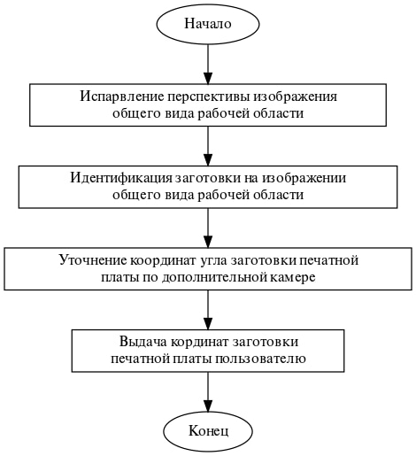

# О возможном подходе к решению задачи об интеллектуальной индентификации заготовки печатной платы на рабочей области CNC станка

*Рассматривается возможный подход к решению задачи об интеллектуальной индентификации заготовки печатной платы на рабочей области CNC станка. С применением методов ....*

***Ключевые слова:*** Изготовление печатных плат, CNC станок, идентификация рабочей области, OpenCV, Canny.

**Введение.** При изготовлении печатных плат, изделие, состоящее из плоского изоляционного основания с отверстиями, пазами, вырезами и системой токопроводящих полосок металла (проводников), которое используют для установки и коммутации электрорадиоизделия (ЭРИ) и функциональных узлов в соответствии с электрической принципиальной схемой, на CNC станке одним из важных этапов является определение координат расположения заготовки. От точности определения координат заготовки зависит дальнейшее качество изготовления продукта. Так же высокая точность позволяет сделать так чтобы можно было фигачить с двух сторон, переворачивать платы как хочешь, и не портить рабочий стол при фрезеровки и сверлении сразу нафиг насквозь.

**Обзор аналогов.**

Обзор чего есть:

Исследователи из Орхусского университета [6] разрабатывают систе-
му ЧПУ для лазерного резака на основе комбинирования маркеров и дополненной реально-
сти. Система основана на подходе WYSIWYG*, где проектор используется для отображения
текущих контуров, а маркеры используются для установки его положения в рабочей области.
*
What You See Is What You Get (англ.) — что видите, то и получаете
ИЗВ. ВУЗОВ. ПРИБОРОСТРОЕНИЕ. 2020. Т. 63, № 9832
М. Я. Афанасьев, Ю. В. Федосов, А. А. Крылова, С. А. Шорохов
Наряду с этим специалисты университета Кейо [7] расширяют функциональность фиду-
циальных* маркеров для лазерного резака. Чтобы установить параметры резки, они разме-
щают набор маркеров опорных точек рядом с заготовкой, в том числе метки, связанные с ма-
териалом, порядком операций и командами.
В работе [8] описан способ обнаружения ошибок контура на основе машинного зрения.
Разработан специальный измерительный прибор с нанесенными на него маркерами, который
позволяет измерять погрешность контура без сетчатого датчика.
В работе [9] предлагается метод прямой симуляции обрабатывающего инструмента
станка. Здесь маркеры используются для определения положения инструмента и заготовки;
дополненная реальность — для моделирования траектории инструмента при обработке. 

**Обзор трёхкоординатной устновки CNC-станка для производства печатных плат**

Рисунок 1. Трёхкоординатная устновка CNC-станка для производства печатных плат

Рисунок 1. Алгоритм работы системы идентификации заготовки печатной платы

Рисунок 2. Результат идентификации контура заготовки печатной платы по изображению с камеры общего вида

Рисунок 3. Результат идентификации угла заготовки печатной платы по изображению с уточняющей камеры
